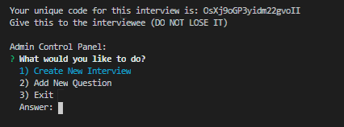
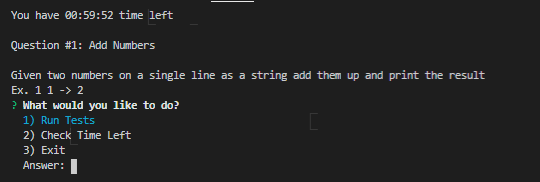
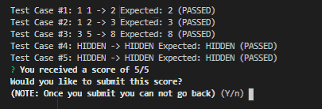

# interview-cli
a coding interview command line interface application made using node.js

# Installation

Make a clone of the git repository

```bash
git clone https://github.com/whyroland/interview-cli.git
```

cd into the cloned repository on your computer

You may use your command line of choice, as long as you are cd'd into the repository the program should work

Use npm and install the following packages
```bash
npm install inquirer
npm install inquirer-loop
npm install firebase
npm install nodemailer
```

After that run

```bash
npm install -g
```

to install the program and be able to use the commands below

# Usage
To generate a code to begin your interview use
```bash
interview-admin
```
The password is by default set to "password" but this can be changed inside of bin/admin.js

Be sure to save the code it gives you, only other way to see it is through my firebase account :) will work on making the process more accessible in the future



To do the interview use
```bash
interview
```

This will prompt you with a setup to enter the code you were given before, do that and you will have full access to the interview





# Known Bugs

- Invalid inputs will crash the program (see future plans)

# Future Plans

- Clean up this hot mess of code O_O
- Add in Java, C, and C++ support
- Add in email support with nodemailer
- Add more features to the admin panel
- Go through the inquiries and validate the inputs
- Make it look prettier with chalk