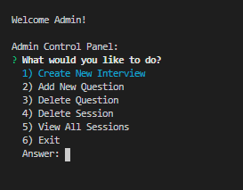
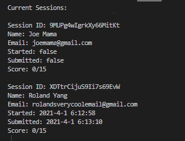
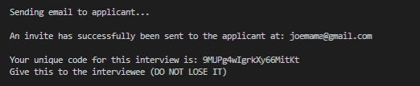
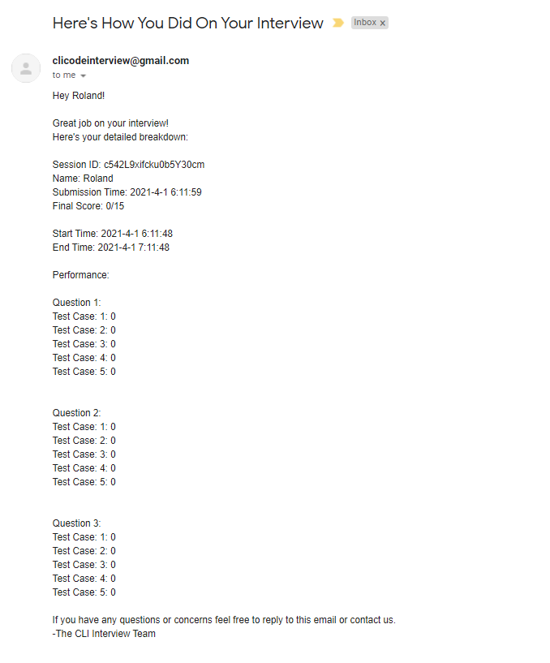

# interview-cli
a coding interview command line interface application made using node.js

# Installation

Make a clone of the git repository

```bash
git clone https://github.com/whyroland/interview-cli.git
```

cd into the cloned repository on your computer

You may use your command line of choice

**You must be CD'd into the repository else you will be unable to grade your code**

**Make sure your Enviornment Variables and Paths are correctly setup else the program will crash when you try to run test cases**

Use npm and install the following packages
```bash
npm install inquirer
npm install inquirer-loop
npm install firebase
npm install nodemailer
```

After that run

```bash
npm install -g
```

to install the program and be able to use the commands below

# Usage
To generate a code to begin your interview use
```bash
interview-admin
```
The password is by default set to "password" but this can be changed inside of bin/admin.js

Be sure to save the code it gives you, only other way to see it is through my firebase account :) will work on making the process more accessible in the future







To do the interview use
```bash
interview
```

This will prompt you with a setup to enter the code you were given before, do that and you will have full access to the interview




**In order to submit your code, choose the file format you want to write your solution in and write it in the answers folder under the corresponding language file you want to write it in**

# Known Bugs

- Invalid inputs will crash the program (see future plans)
- C and C++ need to be fixed (I have to figure out how to get the paths on my PC setup)
- Sometimes the Firestore will not update fast enough so the final email report will be missing some test cases in the performance section

# Future Plans

- Clean up this hot mess of code O_O
- Add more features to the admin panel
- Hide credentials for security reasons
- Go through the inquiries and validate the inputs
- Make it look prettier with chalk
